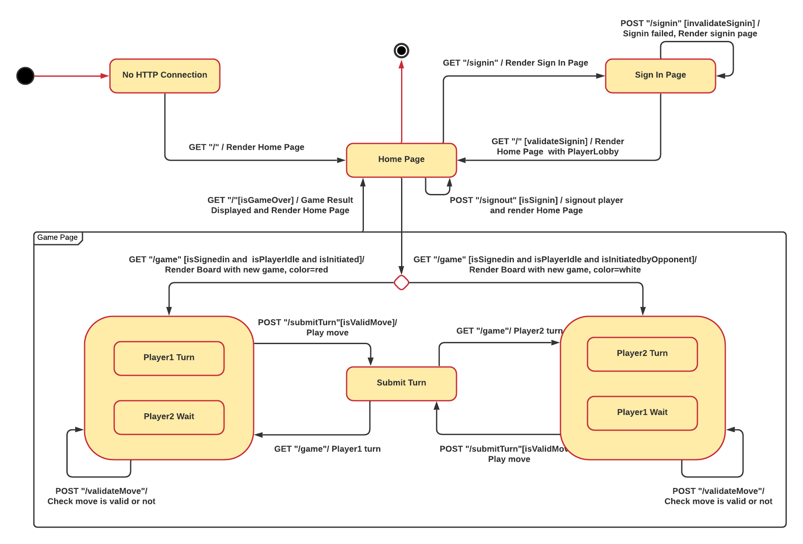
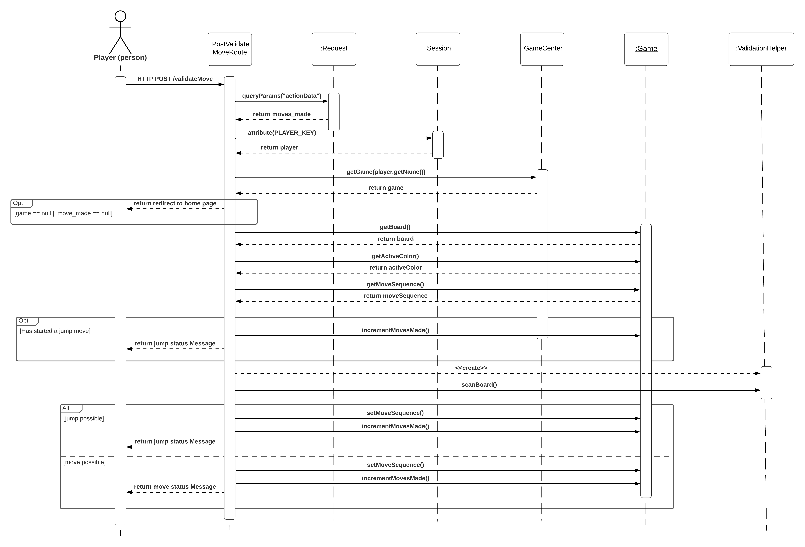
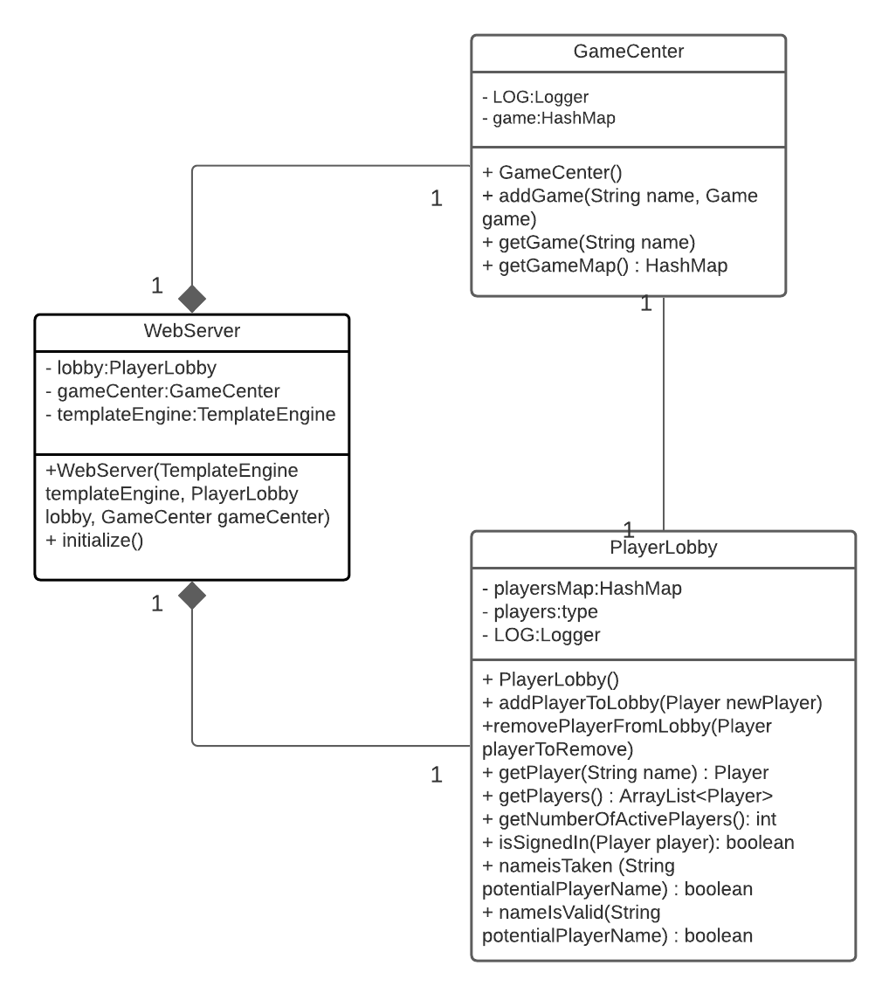
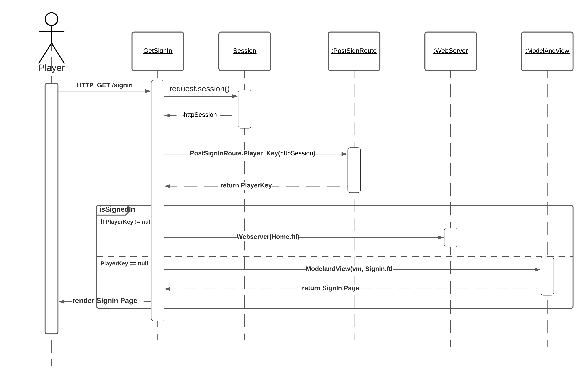
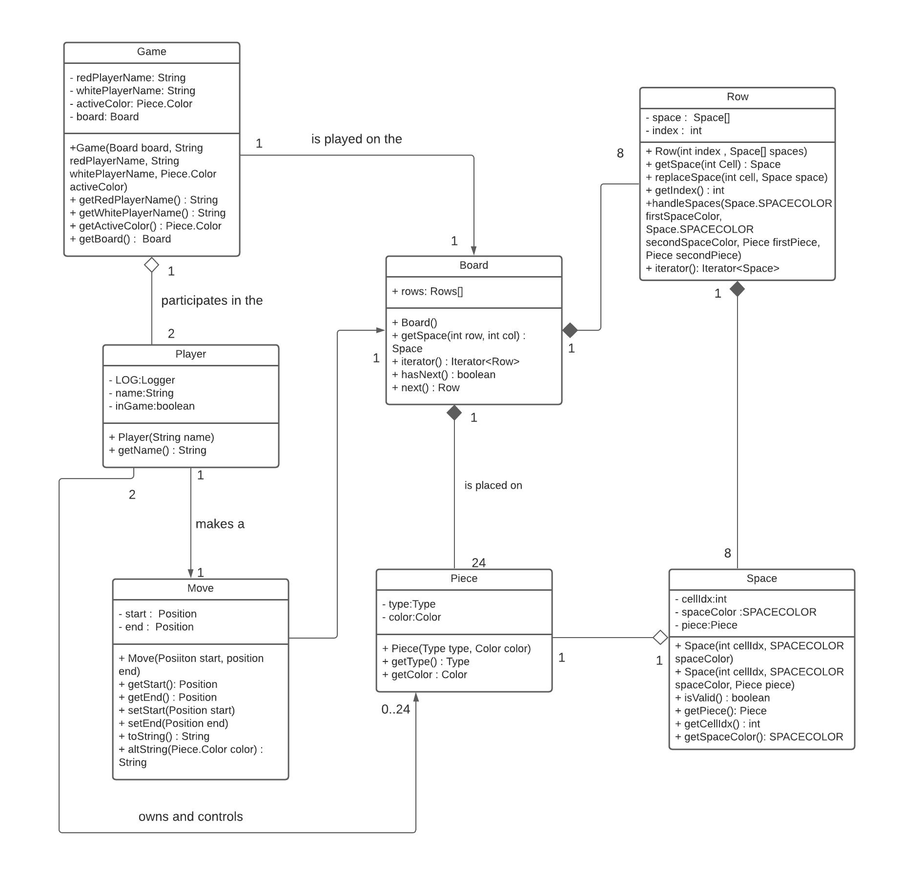
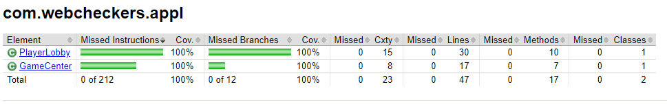
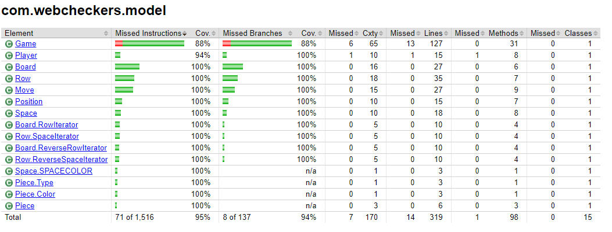
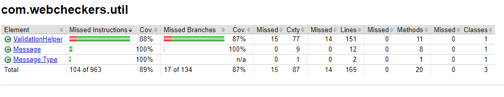
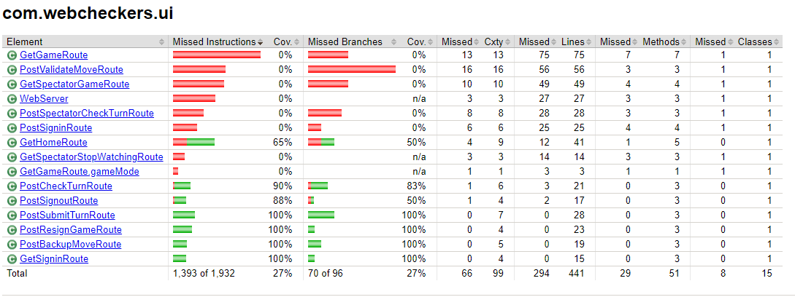

# PROJECT Design Documentation

## Executive Summary

Webcheckers is a web-based Java application that utilizes the Spark and Freemarker frameworks.
Users are able to sign in, pick their opponents, and engage with them in standard games of American
Checkers.

### Purpose

WebCheckers provides a way for two people to play a game of checkers virtually via a web browser. All standard American rules for a game of checkers is
followed to make sure that the experience is the same as it would be if checkers were to be played with
a physical board and pieces.

### Glossary and Acronyms

| Term | Definition |
|------|------------|
| VO | Value Object |
| VM | View Model    |
| MVP | Minimum Viable Product |
| POJO | Plain-Old Java Object |

## Requirements

This section describes the features of the application.

### Definition of MVP

Before playing, a user is required to sign in to the application to play. A player is then be able to sign out when finished playing.

After a player has selected another player (both logged-in and visible to one another), a game of checkers can be played. This must be done 
with the logic described in the American rules of Checkers. The game of checkers between these two players will end either in one of them capturing
all of the other player's pieces, or once one of the players forfeits the game.

### MVP Features

* Player Sign-in
* Start a Game
* Player Sign-out
* View Active Player
* Upgrade to King
* View Moves Made
* Checker Movement
* Checker Jump
* Chaining Checker Jumps
* Capture Checker Piece

### Roadmap of Enhancements
1. Spectator Feature
2. Chat Feature

The spectator enhancement has been implemented in the application.

## Application Domain

The application domain mirrors that of a real checkers game. Each game, which is bound by the
American rules for checkers, contains a number of components. The checkers board contains an 8x8 collection
of squares which are either dark or light. Dark squares can hold a checker piece, which is red
or white depending on the player. Players, which sign-in to the application to play, access
a GUI where they can interact with their pieces on the board. Each player gets 12 checkers to start.

## Architecture and Design

This section describes the application architecture.

### Summary

The following Tiers/Layers model shows a high-level view of the webapp's architecture.

As a web application, the user interacts with the system using a
browser.  The client-side of the UI is composed of HTML pages with
some minimal CSS for styling the page.  There is also some JavaScript
that has been provided to the team by the architect.

The server-side tiers include the UI Tier that is composed of UI Controllers and Views.
Controllers are built using the Spark framework and View are built using the FreeMarker framework.
The Application and Model tiers are built using plain-old Java objects (POJOs).

Details of the components within these tiers are supplied below.

### Overview of User Interface

This section describes the web interface flow; this is how the user views and interacts
with the WebCheckers application.

When a user first connects to the web server running an instance of WebCheckers, they are presented
with a home page containing a link to sign in and the number of players that are currently logged in.
When the sign-in link is clicked, the user is taken to a page where they are given the
opportunity to pick a valid and not currently-in-use name. Once a valid name is picked, they are 
taken back to the home screen, where all active players and their names are presented. If the 
user wants to start a game, they click on the name of their desired opponent and are taken into the game
page, where they are given the first turn as the red-pieces player. If the player is picked by another
user, they are taken into the game page as the white player and wait for the red player to make a move. 
Each player takes turns and plays checkers until one of them forfeits or wins. At that point, the players
are taken back to the home screen and start the process over again.

### UI Tier

The UI tier is in charge of handling HTTP requests. The player can log in, log out, play the webchecker game, and resign.
It manages all routes, including Home, SignIn, Signout, and so on. It also allowed users to undo and submit their actions by sending huge enums in unusual ways. It also takes care of removing users from a game if they resign or win.

#### Dynamic Model: Sequence Diagram for validateMove

> _Provide a summary of the Server-side UI tier of your architecture.
> Describe the types of components in the tier and describe their
> responsibilities.  This should be a narrative description, i.e. it has
> a flow or "story line" that the reader can follow._

> _At appropriate places as part of this narrative provide one or more
> static models (UML class structure or object diagrams) with some
> details such as critical attributes and methods._

> _You must also provide any dynamic models, such as statechart and
> sequence diagrams, as is relevant to a particular aspect of the design
> that you are describing.  For example, in WebCheckers you might create
> a sequence diagram of the `POST /validateMove` HTTP request processing
> or you might show a statechart diagram if the Game component uses a
> state machine to manage the game._

> _If a dynamic model, such as a statechart describes a feature that is
> not mostly in this tier and cuts across multiple tiers, you can
> consider placing the narrative description of that feature in a
> separate section for describing significant features. Place this after
> you describe the design of the three tiers._

### Application Tier

The GameCenter and PlayerLobby are managed by the application tier. Players are directed to the PlayerLobby when they sign in. The PlayerLobby needs to keep track of whether or not a player is in a game. When a player is challenged, they are sent to the GameCenter. The GameCenter is responsible for assigning players to games as well as dealing with resigning players.

#### Static Model: Class Diagram

#### Dynamic Model: Sequence Diagram for SignIn

### Model Tier
The actual game logic is handled by Model Tier. It contains a game class that keeps track of the state of a Board and two Players, allowing movements to be undone while keeping the state safe. The board contains its own state for keeping track of the current turn, as well as a list of rows that make up the board itself. Each row is made up of a list of spaces that make up the row. Each space can be designated as invalid or valid, and if it includes a piece, it can be labeled as such.

#### Static Model: Class Diagram

### Code Metrics Analysis

* <u>Complexity</u>
     * <b><i>Consider</i></b>
       * In terms of cyclomatic complexity (v(G)), 1-4 is generally considered low, 5-7 indicates moderate complexity,  
  and 8-10 is high complexity. 11+ is considered very high.
       * The WMC value is the "weighted method complexity" of a class. It represents the
       complexity of all the methods in the class as a unit.
     * <b>At the method level, the following Methods had outstanding v(G):</b>
       * <i>ui.PostValidateMoveRoute.handle()</i>
         * The v(G) was 14, with an ev(G) of 12 and iv(G) of 13. This means that handle() has very complex control flow logic
           (if/else/&&/||/swtich/etc.), calls many other methods, and contains complex internal logic.
       * <i>util.ValidationHelper.addAJump()</i>
         * The v(G) was 21, with an ev(G) of 2 and iv(G) of 20. Although addAJump() does not have very complex inner logic, it makes many calls to other methods
         and contains complex control flow logic.
       * <i>util.ValidationHelper.initMoves()</i>
         * The v(G) was 22, with an ev(G) of 1 and iv(G) of 20. Although initMoves() has simple inner logic, it makes many calls
         to other methods and contains complex control flow logic.
     * <b>At the class level, the following classes had outstanding WMCs</b>
       * <i>util.ValidationHelper</i>
         * WMC of 52, most likely due to the 5.20 average operation complexity.
       * <i>model.Game</i>
         * WMC of 54, most likely due to the abundance of methods in the class, as well as
         the maximum operation complexity of 8.
     * <b>There is no outstanding complexity to report at the package, module, and project levels.</b> 
* <u>Chidamber-Kemerer</u> 
    * <b><i>Consider</i></b>
      * WMC : Weighted Method Complexity
      * CBO : Coupling between Objects
      * DIT : Depth of Inheritance Tree
      * LCOM : Lack of Cohesion Methods
      * NOC : Number of Children
      * RFC : Response for Class
    * <b>For all the above-mentioned metrics, there are no outstanding results to report, 
    which suggests the following:</b>
      * Classes in WebChekers are easy to develop and maintain
      * The design complexity is appropriate
      * Class hierarchy breadth is not too large
      * Coupling is pertinent
      * Classes communicate with each other at an adequate frequency
* <u>Javadoc Coverage</u>
  * <b><i>Consider</i></b>
    * Jc = Javadoc Class Coverage
    * Jm = Javadoc Method Coverage
  * <b>Jc and Jm at Package Level</b>
    * <i>webcheckers</i>
      * Jc: 100%
      * Jm: 60%
    * <i>webcheckers.appl</i>
      * Jc: 100%
      * Jm: 93%
    * <i>webcheckers.application</i>
      * Jc: 50%
      * Jm: 26.67%
    * <i>webcheckers.model</i>
      * Jc: 55.56%
      * Jm: 38.85%
    * <i>webcheckers.ui</i>
      * Jc: 52.17%
      * Jm: 63.24%
    * <i>webcheckers.util</i>
      * Jc: 40%
      * Jm: 25%
  * <b>Jc and Jm at Project Level</b>
    * Jc: 53.19%
    * Jm: 46.13%
  * <b>The point of the javadoc metric is not to enforce a defined coverage, but to help developers check
      the current documentation coverage; unfortunately, the enforcement of a fixed coverage can lead to many useless javadoc
      comments. Therefore, it is ultimately up to the developers to write meaningful documentation where it is needed, or none at
      all if the code is self-documenting. </b>
* <u>Lines of Code</u>
  * <b><i>Consider</i></b>
    * LOC: Lines of Code
    * LOCp: Lines of Code (Product)
    * NCLOCp: Non-Comment Lines of Code (Product)
    * NCLOCt: Non-Comment Lines of Code (Test)
  * <b>Package Level Lines of Code </b>
    * <i>webcheckers.appl</i>
      * LOC: 166
      * LOCp: 120
      * NCLOCp: 160
      * NCLOCt: 151
    * <i>webcheckers.model</i>
      * LOC: 1788
      * LOCp: 1095
      * NCLOCp: 841
      * NCLOCt: 659
    * <i>webcheckers.ui</i>
      * LOC: 2110
      * LOCp: 1198
      * NCLOCp: 1109
      * NCLOCt: 670
    * <i>webcheckers.util</i>
      * LOC: 447
      * LOCp: 298
      * NCLOCp: 279
      * NCLOCt: 149
  * <b>Project Level Lines of Code</b>
    * LOC: 18137
    * LOCp: 6332
    * NCLOCp: 5071
    * NCLOCt: 1483
  * <b>One can definitely observe that the LOC metric tends to be the largest,
  followed by the LOCp, NCLOCp, and NCLOCt metrics. This is expected, as "product" code does not include comments.
  It does however include declarations, definitions, directives, and code.</b>
* <u>Martin Package</u>
  * <b><i>Consider</i></b>
    * A: Abstractness
      * (number of abstract classes) / (number of classes)
      * Should be close to 0 or 1
    * Ca: Afferent Coupling
      * The sensitivity of remaining packages to changes in the analyzed package.
      * Should be 0 - 500
    * Ce: Efferent Coupling
      * The number of classes in a given package that depend on classes in other packages
      * Should be low or package may be unstable
    * I : Instability
      * The relative susceptibility of the package to changes
      * I = (Ce) / (Ce + Ca)
      * Should be 0 to 0.3 or 0.7 to 1
    * D: Normalized Distance from Main Sequence
      * used to measure the balance between I and A
      * D = |A + I - 1|
      * Should be as low as possible
  * <b>Results</b>
    * <i>webcheckers.appl</i>
      * A: 0
      * Ca: 171
      * Ce: 26
      * D: 0.87
      * I: 0.13
    * <i>webcheckers.model</i>
      * A: 0
      * Ca: 672
      * Ce: 11
      * D: 0.98
      * I: 0.02
    * <i>webcheckers.ui</i>
      * A: 0
      * Ca: 5
      * Ce: 439
      * D: 0.01
      * I: 0.99
    * <i>webcheckers.util</i>
      * A: 0
      * Ca: 108
      * Ce: 403
      * D: 0.21
      * I: 0.79
  * <b>The A metrics are 0 across the board because WebCheckers does not utilize abstract classes. Instability
  levels are normal as well, as they are all between 0 and 0.3 or 0.7 and 1.0. This means that WebCheckers classes 
  are either very stable or very unstable. The
  Ce and Ca metrics are valid as well, as when the Ce is low, the I tends to be low, and when the Ca is low, the I
  tends to be high. 
   </b>

## Testing

### Acceptance Testing
All of the acceptance criteria tests have passed. There are currently 
no user stories that have not been acceptance tested. 

Issues found during acceptance testing:
* If one user resigned and the other user logged out, an error would occur. This has since been fixed.

### Unit Testing and Code Coverage

### Design Comments
* The Controller Principle has been followed. This principle was followed in the PlayerLobby and GameCenter classes.
* Special attention was paid to the notion of single responsibility principle and had a high level of cohesion. A class should only have one task and one goal. For example, strictly adhered to the Single Responsibility Principle in our UI tier (GetGameRoute, GetHomeRoute, and so on).
* A pure fabrication is a class that does not reflect a concept in the issue domain but assists in the adoption of those cohesive sets of responsibilities that support high cohesion, low coupling, and reuse. In validating the moves helper function, followed this principle.
